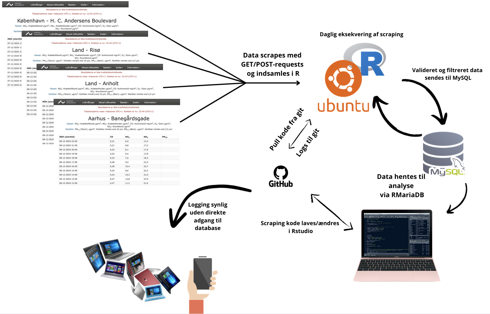
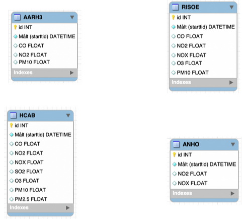
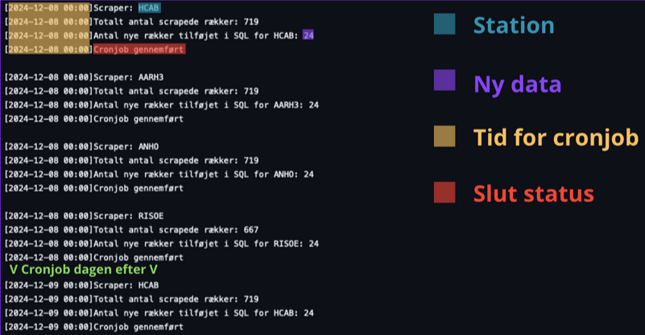

# Automatiseret Dataindsamling på AWS

## Oversigt
Dette projekt opsætter en **fuldautomatisk pipeline** til indsamling af luftkvalitetsdata fra flere målestationer i Danmark.  
Løsningen kører på **AWS Ubuntu EC2**, henter data via **R-scripts** og gemmer dem i en **MySQL-database**.

## Arkitektur
Systemet følger en struktureret proces:


1. **Dataindsamling** – Webscraping med R for at hente målinger fra Aarhus Universitets målestationer.
2. **Databehandling** – Data struktureres, valideres og filtreres for at sikre kvalitet.
3. **Lagring i MySQL** – Data gemmes i en MySQL-database på EC2-instansen.
4. **Automatisering med Cron** – Daglig dataindsamling via et cron-job.
5. **Logging og Overvågning** – Fejl håndteres og logges automatisk.

## Teknologier
- **AWS EC2** – Cloud-server til at køre R-scripts og MySQL-databasen.
- **Ubuntu** – Valgt som operativsystem for effektiv ressourcestyring.
- **R & RMariaDB** – Bruges til webscraping og databasehåndtering.
- **Crontab** – Automatiserer script-eksekvering dagligt.
- **Logging & GitHub Integration** – Fejl og succesfulde kørsler logges og gemmes i et repository.

## Opsætning

### 1. AWS EC2 & MySQL
- En **Ubuntu EC2-instans** oprettes på AWS.
- Swap-konfiguration sikrer stabil installation af R-pakker.
- **MySQL** opsættes til at gemme data eksternt.


### 2. R-script til Webscraping
- Data webscrapes via **GET- og POST-requests** fra Aarhus Universitets målesystem.
- Data valideres og konverteres til et struktureret format.
- **Kun nye målinger indsættes** for at undgå duplikering.

### 3. Automatisering med Crontab
- Et cron-job eksekverer R-scriptet **dagligt ved midnat**.
- Shell-scriptet kalder R-scriptet dynamisk for hver station.
```sh
0 0 * * * /bin/bash /path/to/shell_script.sh
```
### 4. Logging og Fejlbehandling
- **Fejl håndteres med `tryCatch()`** i R, og logfiler opdateres automatisk.
- **Logs gemmes i GitHub** via automatiseret push.


## Resultat
Systemet sikrer en **effektiv, sikker og skalerbar** løsning til dataindsamling.  
Det kan let udvides med flere målestationer og kræver minimal manuel vedligeholdelse.
